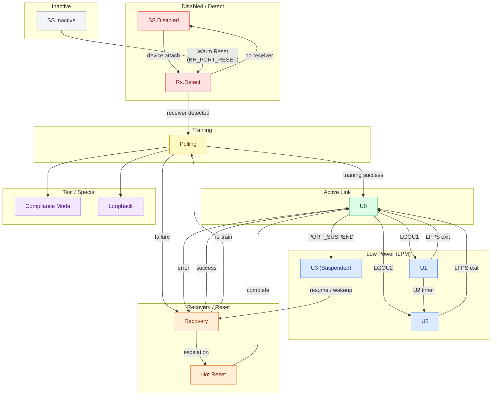

# SS LTSSM State Reference

> Scope: USB 3.2 Specification Rev 1.0, §7 (Physical Layer), §7.5 (Link Training and Status State Machine).
> This page is an orientation reference for LTSSM state names, state groups, and high-level transition paths.
> **Important**: This page does not claim timing, PHY, electrical, equalization, or compliance behavior.

## Purpose

This page answers:

- What states make up the USB 3.x Link Training and Status State Machine (LTSSM).
- How LTSSM states are grouped by function.
- Which states commonly lead to which other states (high-level orientation only).

This page does not answer:

- Complete normative state transition tables or conditions.
- LFPS signaling waveforms, timing parameters, or electrical requirements.
- xHCI driver role in LTSSM transitions.
- PHY equalization, receiver training, or TX/RX compliance.
- Firmware implementation correctness.

**Relationship to hub class:** The LTSSM is a physical-layer mechanism. The USB 3.x hub class observes link state indirectly through `PORT_LINK_STATE` (wPortStatus bits[8:5]). The hub-class-observable U-states (U0/U1/U2/U3) are outcomes of LTSSM transitions; the hub class does not drive the LTSSM directly.

---

## LTSSM State Groups

| Group | States | Function |
|---|---|---|
| Disabled / Detect | SS.Disabled, Rx.Detect | Link is disabled or in receiver-detection phase |
| Inactive | SS.Inactive | Link entered inactive state; requires Warm Reset to exit |
| Training | Polling | Link training and bit-lock acquisition |
| Active Link | U0 | Normal operating state; data transfer |
| Low Power | U1, U2, U3 | Link power management states (LPM) |
| Recovery / Reset | Recovery, Hot Reset | Error recovery or host-initiated link reset |
| Test / Special | Compliance Mode, Loopback | Compliance testing and loopback diagnostics |

---

## Simplified LTSSM Orientation Diagram

> **Orientation only.** This diagram shows common high-level transition paths between LTSSM state groups.
> It is not a complete normative transition matrix. Timing, LFPS signaling, PHY, equalization, and compliance details are not shown.
> **Click any state node** to navigate to related reference content on this site.

---

## High-Level Transition Orientation

The following table shows common next-state paths. This is an orientation summary, not a complete normative transition matrix.

| From | Common next states | Notes |
|---|---|---|
| SS.Disabled | Rx.Detect | Link exits disabled state to detect a receiver (device attach) |
| Rx.Detect | Polling | Receiver detected; begin link training |
| Rx.Detect | SS.Disabled | No receiver detected; link remains or returns to disabled |
| Polling | U0 | Training succeeded; link becomes active |
| Polling | Recovery, SS.Disabled | Training failed; recovery or disable |
| U0 | U1, U2 | Device or host initiates LPM entry |
| U0 | U3 | Host issues `SET_FEATURE(PORT_SUSPEND)` |
| U0 | Recovery | Error condition; link enters recovery |
| U1 | U0 | LPM exit (LFPS handshake) |
| U1 | U2 | U2 inactivity timer expires while in U1 |
| U2 | U0 | LPM exit (LFPS handshake) |
| U3 | Recovery / U0 path | Host resume or device remote wakeup (LFPS + link resume) |
| Recovery | U0 | Recovery succeeded; link returns to active |
| Recovery | Polling | Recovery failed; re-enter training |
| Recovery | Hot Reset | Recovery escalation |
| Hot Reset | U0 / Polling | Reset complete; link re-initializes |
| SS.Inactive | Rx.Detect | Warm Reset (BH_PORT_RESET) issued; re-detect receiver |
| Compliance Mode | — | Entered from Polling; exit requires hardware intervention |
| Loopback | — | Entered for test purposes; exit requires reset |

> **Note:** U3 → U1 or U2 is not a direct transition. The link must exit U3 to U0 first, then may enter U1 or U2. Similarly, U2 → U1 is not direct; exit to U0 is required first.

---

## Hub Port State Relationship

The `PORT_LINK_STATE` field in `wPortStatus` reflects a subset of LTSSM states at the hub class layer:

| PORT_LINK_STATE value | LTSSM / Link state | Observable via hub class? |
|---|---|---|
| 0x0 | U0 | Yes — hub class active state |
| 0x1 | U1 | Yes — LPM observable |
| 0x2 | U2 | Yes — LPM observable |
| 0x3 | U3 | Yes — Suspend state |
| 0x4 | Disabled | Encoding visible; LTSSM behavior not hub class |
| 0x5 | Rx.Detect | Encoding visible; LTSSM behavior not hub class |
| 0x6 | Inactive | Encoding visible; LTSSM behavior not hub class |
| 0x7 | Polling | Encoding visible; LTSSM behavior not hub class |
| 0x8 | Recovery | Encoding visible; LTSSM behavior not hub class |
| 0x9 | Hot Reset | Encoding visible; LTSSM behavior not hub class |
| 0xA | Compliance Mode | Encoding visible; LTSSM behavior not hub class |
| 0xB | Loopback | Encoding visible; LTSSM behavior not hub class |

The hub class can read these values from `GET_STATUS(port)` but does not control LTSSM transitions for values 0x4–0xB. Those transitions are driven by the physical layer and are defined in USB 3.2 §7.

---

## This Page Does Not Claim

- Normative LTSSM transition conditions or exit criteria.
- LFPS signaling waveforms or timing parameters.
- PHY equalization, receiver sensitivity, or link training convergence.
- xHCI warm reset or port reset interaction with LTSSM.
- USB-IF compliance or interoperability certification.
- Firmware correctness or driver implementation behavior.

---

→ [SS Port State Machine](ss_port_state_machine.md) | [SS Port Status Bits](ss_port_status_bits.md) | [SS Hub Class Requests](ss_hub_class_requests.md) | [Verification Status](../verification_status.md)
