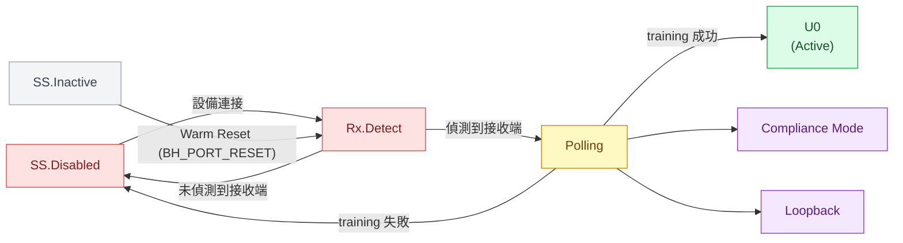
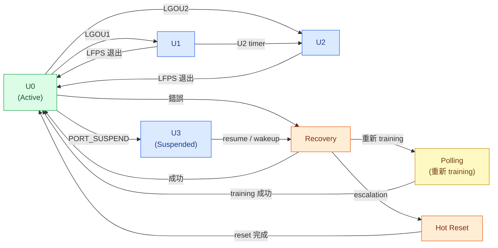

# SS LTSSM 狀態參考

> 資料範圍：USB 3.2 Specification Rev 1.0，§7（Physical Layer），§7.5（Link Training and Status State Machine）。
> 本頁是 LTSSM 狀態名稱、狀態群組與高層次轉換路徑的導向參考，不是完整 LTSSM 行為驗證紀錄。
> **重要**：本頁不宣告時序、PHY、電氣特性、均衡器、或 compliance 行為。

## 頁面目的

本頁回答：

- USB 3.x Link Training and Status State Machine（LTSSM）包含哪些狀態。
- 這些狀態依功能如何分群。
- 哪些狀態通常接續哪些狀態（僅高層次導向）。

本頁不回答：

- 完整的 normative state transition 條件與退出條件。
- LFPS 信號波形、時序參數、或電氣規格。
- xHCI driver 在 LTSSM 轉換中的角色。
- PHY 均衡器訓練、接收端靈敏度、或 TX/RX compliance 行為。
- Firmware 實作正確性。

**與 hub class 的關係：** LTSSM 是 physical layer 機制。USB 3.x hub class 透過 `PORT_LINK_STATE`（wPortStatus bits[8:5]）間接觀察 link 狀態。Hub class 可觀察的 U-states（U0/U1/U2/U3）是 LTSSM 轉換的結果；hub class 不直接驅動 LTSSM。

---

## LTSSM 狀態群組

| 群組 | 狀態 | 功能 |
|---|---|---|
| Disabled / Detect | SS.Disabled, Rx.Detect | Link 被停用或正在偵測接收端 |
| Inactive | SS.Inactive | Link 進入 inactive；需要 Warm Reset 才能退出 |
| Training | Polling | Link training 與 bit-lock 取得 |
| Active Link | U0 | 正常運作狀態；可進行資料傳輸 |
| Low Power | U1, U2, U3 | Link 電源管理狀態（LPM） |
| Recovery / Reset | Recovery, Hot Reset | 錯誤恢復或 host 發起的 link reset |
| Test / Special | Compliance Mode, Loopback | Compliance 測試與 loopback 診斷 |

---

## Simplified LTSSM Orientation Diagram

> **僅供導向參考。** 本圖顯示 LTSSM 狀態群組之間的常見高層次轉換路徑。
> 這不是完整的 normative transition matrix。時序、LFPS 信號、PHY、均衡器、compliance 細節均未顯示。
> **點擊任一狀態節點**可跳轉至本站相關參考頁面。

### 圖一 — Link 啟動與 Training 路徑

### 圖二 — U-State 電源管理與 Recovery

---

## 高層次轉換導向

以下表格列出常見的後續狀態路徑。這是導向摘要，不是完整的 normative transition matrix。

| 起始 | 常見後續狀態 | 說明 |
|---|---|---|
| SS.Disabled | Rx.Detect | Link 退出 disabled 狀態以偵測接收端（設備連接） |
| Rx.Detect | Polling | 偵測到接收端；開始 link training |
| Rx.Detect | SS.Disabled | 未偵測到接收端；link 維持或回到 disabled |
| Polling | U0 | Training 成功；link 進入 active |
| Polling | Recovery, SS.Disabled | Training 失敗；進入 recovery 或 disabled |
| U0 | U1, U2 | 裝置或 host 發起 LPM entry |
| U0 | U3 | Host 發出 `SET_FEATURE(PORT_SUSPEND)` |
| U0 | Recovery | 發生錯誤；link 進入 recovery |
| U1 | U0 | LPM 退出（LFPS handshake） |
| U1 | U2 | 在 U1 期間 U2 inactivity timer 到期 |
| U2 | U0 | LPM 退出（LFPS handshake） |
| U3 | Recovery / U0 路徑 | Host resume 或設備 remote wakeup（LFPS + link resume） |
| Recovery | U0 | Recovery 成功；link 回到 active |
| Recovery | Polling | Recovery 失敗；重新進入 training |
| Recovery | Hot Reset | Recovery escalation |
| Hot Reset | U0 / Polling | Reset 完成；link 重新初始化 |
| SS.Inactive | Rx.Detect | 發出 Warm Reset（BH_PORT_RESET）；重新偵測接收端 |
| Compliance Mode | — | 從 Polling 進入；退出需硬體介入 |
| Loopback | — | 為測試目的進入；退出需要 reset |

> **注意：** U3 → U1 或 U2 不是直接轉換。Link 必須先從 U3 退出到 U0，之後才可進入 U1 或 U2。同樣地，U2 → U1 不可直接跳；必須先退出到 U0。

---

## Hub Port State 對應關係

`wPortStatus` 的 `PORT_LINK_STATE` 欄位在 hub class 層反映部分 LTSSM 狀態：

| PORT_LINK_STATE 值 | LTSSM / Link 狀態 | 可透過 hub class 觀察？ |
|---|---|---|
| 0x0 | U0 | 是 — hub class active state |
| 0x1 | U1 | 是 — LPM 可觀察 |
| 0x2 | U2 | 是 — LPM 可觀察 |
| 0x3 | U3 | 是 — Suspend 狀態 |
| 0x4 | Disabled | Encoding 可見；LTSSM 行為不屬於 hub class |
| 0x5 | Rx.Detect | Encoding 可見；LTSSM 行為不屬於 hub class |
| 0x6 | Inactive | Encoding 可見；LTSSM 行為不屬於 hub class |
| 0x7 | Polling | Encoding 可見；LTSSM 行為不屬於 hub class |
| 0x8 | Recovery | Encoding 可見；LTSSM 行為不屬於 hub class |
| 0x9 | Hot Reset | Encoding 可見；LTSSM 行為不屬於 hub class |
| 0xA | Compliance Mode | Encoding 可見；LTSSM 行為不屬於 hub class |
| 0xB | Loopback | Encoding 可見；LTSSM 行為不屬於 hub class |

Hub class 可透過 `GET_STATUS(port)` 讀取這些值，但無法控制值 0x4–0xB 的 LTSSM 轉換。這些轉換由 physical layer 驅動，定義於 USB 3.2 §7。

---

## 本頁不宣告

- Normative LTSSM transition 條件或退出條件。
- LFPS 信號波形或時序參數。
- PHY 均衡器、接收端靈敏度、或 link training 收斂行為。
- xHCI warm reset 或 port reset 與 LTSSM 的互動。
- USB-IF compliance 或互通性認證。
- Firmware 正確性或 driver 實作行為。

---

→ [SS Port State Machine](ss_port_state_machine.md) | [SS Port Status Bits](ss_port_status_bits.md) | [SS Hub Class Requests](ss_hub_class_requests.md) | [Verification Status](../verification_status.md)
